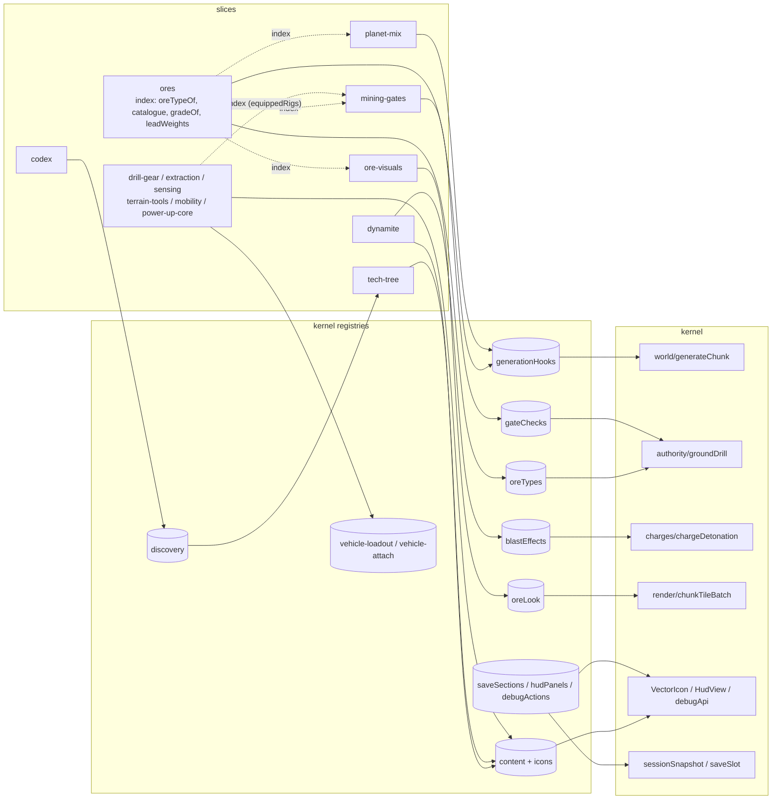

# Feature slices: how materials, dynamite, planet mixes, gates and visuals ship in parallel

Standard for #155. Build ticket: #156. Owner: Technical Director. Decided 2026-10-06 against `main` at `af0d3db` (`src/` unchanged at `5987e09`).

Up to four loop sessions build at once (`/workspace/claude-sessions/steampunk-loop`). The code is grouped by layer, so every feature edits the same shared lists and the driver's `git rebase origin/main` fails. This standard fixes where feature code lives, how it reaches the kernel without editing it, and what a session may touch. Paths marked **(new)** do not exist yet. Every other path and symbol exists on `main`.

## Decisions at a glance

1. **Kernel = everything in `src/` outside `src/features/`.** Nothing moves in bulk.
2. **A slice is one folder**, `src/features/<slice>/`. The first five: `ores`, `planet-mix`, `mining-gates`, `dynamite`, `ore-visuals`. Then `codex`, `tech-tree`, `power-up-core`, `drill-gear`, `extraction`, `sensing`, `terrain-tools`, `mobility`. `example` is the committed template.
3. **One public file per slice**, `index.ts`. Lint fails any other cross-slice import, and any kernel import of a slice. The tool is `eslint-plugin-import-x` `no-restricted-paths`, with zones generated from the folder list. CI already runs `npm run lint`.
4. **Slices reach the kernel only through append-only registries.** Each slice's `register.ts` is found by one `import.meta.glob` in the loader `src/features/index.ts`. Registries iterate sorted by id and are sealed after loading.
5. **#156 wires every call site with an empty-registry fast path.** Generation, drill, blast, ore look and HUD all ask their registries. With no slice registered, output is byte-identical.
6. **Slice state is a versioned section.** Each section has its own version and is restored by exact match: refused, never migrated. A save written before a section existed gets that section at its initial value (#224). It lives under an optional `slices` key that is omitted while empty. Adding a slice section bumps that section's version and is recorded in the golden header. `SNAPSHOT_VERSION` is not bumped for it.
7. **#156 bumps no version.** The 8 goldens stay byte-identical. Bumps belong to the build that adds state, commands or hooks. Each bump goes in that build's last commit, and on a conflict the build re-bumps as main + 1.
8. **Icons and ore look are kernel registries with enforced ownership.**
   - Every content entry has an `iconId`, and a kernel coverage test fails on any unresolved id.
   - `VectorIcon` gets a visible fallback in #156.
   - Only the `ore-visuals` slice and the kernel loader read the art direction.
9. **`vehicle-loadout`, `vehicle-attach` and `discovery` are kernel registries (#162).**
   - #156 creates them.
   - The builds that land loadout and codex add the state, commands and bumps.
10. **One session, one slice.** Kernel changes get their own small tickets (K1–K5, section 6.3). `gameStore.ts` is not split; it stops growing.
11. **Tests move with their slice's migration (#191).** Kernel tests, shared goldens and cross-slice checks stay in the kernel. There are no symlinks and no re-export files, and `tests/MANIFEST.md` is the overview (section 6.5).

## Why: the measured collisions

From the last 300 commits that touched `src/` or `tests/` (since 2026-10-04 21:54), and `driver.log` (36 failed rebases across 16 tickets; 16 session logs contain `CONFLICT`):

| File | Commits touching it | Session logs with a conflict in it |
| --- | --- | --- |
| `tests/golden/{money-past-1e40,dig-and-return,strand-and-rescue,destroyed-and-towed}.golden.json` | 22 each | 9, 9, 8, 8 |
| `src/systems/authority/sessionSnapshot.ts` / `.test.ts` | 18 / 21 | 6 / 7 |
| `src/systems/art/assetManifest.test.ts` | | 7 |
| `src/systems/authority/authorityCommand.ts` | 23 | 5 |
| `src/systems/art/artCatalogue.ts` | 12 | 5 |
| `src/debug/debugApi.ts` / `debugApi.test.ts` | 26 / 27 | – / 5 |
| `src/debug/debugScreens.test.ts` | 24 | 5 |
| `src/store/gameStore.ts` | 31 | |
| `src/constants/scene.ts` | 30 | |
| `src/logging/eventNames.ts` | 28 | |
| `src/logging/domainEventLog.ts`, `src/systems/authority/domainEvent.ts` | 26, 25 | |
| `src/systems/authority/debugCommandRules.ts`, `src/systems/render/vehicleLook.ts`, `src/store/presentationSlice.ts`, `src/scene/VehiclePlaceholder.tsx`, `applyCommand.test.ts` | | 4 each |

Two causes. **Central lists**:
- `COMMAND_RULES` in `applyCommand.ts`
- `CommandPayloads`
- `DomainEventBodies`
- `RejectionReason`
- `RUN_EVENT_REGISTRY`
- `PROJECTIONS`
- the `DebugActions` intersection in `gameStore.ts`
- the `DebugApi` object
- `vectorIconIds()`

**Version bumps that rewrite every golden.** Registries remove the first cause. The second can't be removed, so it gets a rule (section 5.5).

## 1. Slice layout

### 1.1 Kernel and slices

The kernel is every path in `src/` outside `src/features/`. A slice holds one feature: its data, rules, slice state, UI, art and debug surface.

```
src/features/
  index.ts                  kernel-owned loader (new); the only file at this level besides tests
  sliceBoundaries.test.ts   lint proof (new)
  <slice>/
    index.ts                public API: types, read selectors, constants, intents (after K1)
    register.ts             export const slice: SliceDefinition; no side effects at import
    <slice>.economy.json    the slice's numbers (optional)
    systems/                pure rules: the authority lint set (exact maths, no clock or random)
    systems/render/         pure look maths: exempt from the exact-maths set only
    store/                  optional zustand store fed by listenForDomainEvents
    ui/                     React + CSS Modules
    scene/                  R3F components
    icons/<icon-id>.svg     found by the kernel icon registry
    debug.ts                debug actions (optional)
    *.test.ts               beside the code
```

The subfolder names are the kernel layer names, so the existing layer rules in `eslint.config.js` apply to slices through added globs (section 2.2):
- `systems/` gets `FRAMEWORK_IMPORTS`, `CLOCK_AND_RANDOM`, `NO_IMPORT_META`, `APPROXIMATED_MATH` and `INEXACT_SYNTAX`. These are the sets that cover `src/systems/authority/**`.
- `ui/`, `scene/` and `store/` get the `no-restricted-globals` block.

| Slice | Owns | Stays kernel | Build |
| --- | --- | --- | --- |
| `ores` (#140 said `ore-catalogue`) | Ore catalogue: identity, families, cycle/echo, grade thresholds, lead weights, `requires`; registers `oreTypes` | Value and hardness by tier: `src/systems/economy/oreEconomy.ts` (≈20 kernel importers), the `ore` block of `economy.json` | #146 |
| `planet-mix` | Planet themes and ore roles (#141 `oreThemes.json`, `oreRoles`); registers generation hooks | Patch lattice `src/systems/world/orePatches.ts`, cell layout `worldCell.ts` | #147 |
| `mining-gates` | Gate rules from an ore's `requires`; locked-marker model; registers `gateChecks` | Drill rule `src/systems/authority/groundDrill.ts` | #148 |
| `dynamite` | Sizes, plant/fuse, its blast command (after K1); registers `blastEffects` and `content` `dynamite-size` | Ground removal; the shipped charges code until #153 decides | #149 |
| `ore-visuals` | Ore look by family/tier/grade (#151); registers `oreLook`; ore icons | `src/systems/render/chunkTileBatch.ts`, `artDirection.ts` loader | #144, #150 |
| `example` **(new)** | Template and lint fixture; one read-only debug action | | #156 |
| `codex` | `discovery` provider, `first_contact` handling, `codex` section v1 | `discovery` query point | after K1 |
| `tech-tree` | Nodes, prerequisites, costs, `techTree` section v1 | `content` registry | #165 |
| `power-up-core` | Charge classes, activation, power-up logs. **Not** the loadout | `vehicle-loadout` | #162 builds |
| `drill-gear`, `extraction`, `sensing`, `terrain-tools`, `mobility` | Item rows registered as `vehicle-item` content with slot acceptance and attach id | `vehicle-loadout`, `vehicle-attach` | #162 builds |

The first five are the ones created first. Later slices follow the same template. #163 and #164 pick their slice ids under the same rule (kebab-case, one folder).

Rejected options:
- Moving `src/systems/*` into slices now. It collides with every open ticket and moves code the materials work never touches.
- Per-layer slice folders (`src/systems/ores`, `src/ui/ores`). The layer folders stay the merge point, and lint has no boundary to anchor on.

### 1.2 Slice id rule

The folder name is the id. Every registered id starts with `<slice>.`, and the registrar throws otherwise. Slice run events are named `<slice_snake>_<event>`, so `eventNames.test.ts` keeps its snake_case rule.

## 2. Public API and boundary lint

### 2.1 `index.ts` is the contract

`index.ts` exports types, pure read selectors, constants and, after K1, command-intent factories and event-name lists. It never exports React, zustand or store objects.
- A slice's own UI reads its own `store/`.
- Other slices never read it.
- A contract change lands in the provider's `index.ts` first, in its own commit. The consumer's ticket names it.

### 2.2 Tool choice

Checked on npm on 2026-10-06. The repo uses ESLint 10.12 flat config. The box runs Node v20.19.2 and the CI `verify` job runs Node 22.

| Option | Verdict |
| --- | --- |
| `eslint-plugin-import` 2.32.0 | Peer `eslint` up to `^9`. Ruled out for ESLint 10. |
| `dependency-cruiser` 18.5.0 | `engines: node ^22.13 \|\| ^24 \|\| >=26`. Sessions run lint on Node 20. Separate CLI, no editor feedback. Ruled out. |
| `eslint-plugin-boundaries` 7.2.0 | Peer `>=6`, works. But it brings a second vocabulary (elements, captures, the new `boundaries/dependencies` policies) for one rule. Not chosen. |
| **`eslint-plugin-import-x` 4.17.1** | Peer `^8.57 \|\| ^9 \|\| ^10`. `import-x/no-restricted-paths` checks resolved paths. **Chosen.** |

### 2.3 Config (verified)

The diff below was applied to a copy of `main` with `npm i -D eslint-plugin-import-x@4.17.1`.
- `npm run lint` passed on the whole tree (about 20 s), and `tsc` and `prettier --check` stayed clean.
- Probes showed each zone fires and the allowed paths pass:
  - a slice importing another slice's internals: error
  - a slice importing another slice's `index.ts`: allowed
  - a slice importing the loader: error
  - the kernel importing a slice: error
  - `bootstrap.ts` and `scripts/` importing the loader: allowed

The zones are generated from `readdirSync`, so adding a slice never edits the config.

```diff
+import { readdirSync } from 'node:fs'
 import js from '@eslint/js'
+import { createNodeResolver, importX } from 'eslint-plugin-import-x'
@@ after the DECIMAL_CONSTRUCTION const
+// Feature slices (docs/standards/feature-slices.md): every folder under src/features is a slice,
+// read at lint time, so adding a slice never edits this file.
+const SLICES = readdirSync('src/features', { withFileTypes: true })
+  .filter((entry) => entry.isDirectory())
+  .map((entry) => entry.name)
+  .sort()
+const KERNEL_DIRS = readdirSync('src', { withFileTypes: true })
+  .filter((entry) => entry.isDirectory() && entry.name !== 'features')
+  .map((entry) => `./src/${entry.name}`)
+const COMPOSITION_ROOTS = ['./src/bootstrap.ts', './src/testSetup.ts', './scripts']
+const SLICE_ZONES = SLICES.map((slice) => ({
+  target: `./src/features/!(${slice})/**/*`,
+  from: `./src/features/${slice}`,
+  except: ['./index.ts'],
+  message: `Another slice imports slice "${slice}" only through src/features/${slice}/index.ts.`,
+}))
+const KERNEL_ZONES = [
+  {
+    target: './src/features/*/**/*',
+    from: './src/features/index.ts',
+    message: 'A slice never imports the loader; it is called by the composition roots only.',
+  },
+  {
+    target: [...KERNEL_DIRS, './src/App.tsx', './src/main.tsx'],
+    from: './src/features',
+    message: 'The kernel never imports a slice: slices register through the kernel registries.',
+  },
+  {
+    target: COMPOSITION_ROOTS,
+    from: './src/features',
+    except: ['./index.ts'],
+    message: 'Composition roots load slices only through src/features/index.ts.',
+  },
+]
+const ART_DIRECTION_JSON = {
+  group: ['**/artDirection.json'],
+  message: 'Only src/systems/render/artDirection.ts reads artDirection.json.',
+}
+const ART_DIRECTION_LOADER = {
+  group: ['**/systems/render/artDirection'],
+  message: 'Ore family, tier and grade come from the ores index; only ore-visuals reads the art direction.',
+}
@@ pure-rules block
-    files: ['src/systems/**/*.ts'],
-    ignores: ['src/systems/**/*.test.ts'],
+    files: ['src/systems/**/*.ts', 'src/features/*/systems/**/*.ts'],
+    ignores: ['src/systems/**/*.test.ts', 'src/features/**/*.test.ts'],
@@ exact-maths block (authority, world, economy, vehicle, money)
+      'src/features/*/systems/**/*.ts',
+    ],
+    ignores: ['src/systems/**/*.test.ts', 'src/features/**/*.test.ts', 'src/features/*/systems/render/**'],
-    ignores: ['src/systems/**/*.test.ts'],
@@ no-restricted-globals block
+      'src/features/*/{scene,ui,store}/**/*.{ts,tsx}',
@@ appended to tseslint.config(...)
+  {
+    files: ['src/**/*.{ts,tsx}', 'scripts/**/*.ts'],
+    plugins: { 'import-x': importX },
+    settings: { 'import-x/resolver-next': [createNodeResolver({ extensions: ['.ts', '.tsx', '.json'] })] },
+    rules: { 'import-x/no-restricted-paths': ['error', { zones: [...SLICE_ZONES, ...KERNEL_ZONES] }] },
+  },
+  {
+    // A second rule name, so these bans never replace the layer bans of no-restricted-imports.
+    files: ['src/**/*.{ts,tsx}'],
+    ignores: ['src/systems/render/artDirection.ts', 'src/systems/render/*.test.ts'],
+    rules: { '@typescript-eslint/no-restricted-imports': ['error', { patterns: [ART_DIRECTION_JSON] }] },
+  },
+  {
+    files: ['src/features/**/*.{ts,tsx}'],
+    ignores: ['src/features/ore-visuals/**'],
+    rules: {
+      '@typescript-eslint/no-restricted-imports': ['error', { patterns: [ART_DIRECTION_JSON, ART_DIRECTION_LOADER] }],
+    },
+  },
```

The full applied diff, 136 lines with prettier formatting, is attached to the #155 resolution.

Pitfalls found while verifying:
- **Repeating a rule overrides it.** In flat config, a later block's `no-restricted-imports` *replaces* the options of an earlier block for the same files. A second block with that rule name silently dropped the `decimal.js` ban. That is why the ownership bans use `@typescript-eslint/no-restricted-imports`.
- **Unresolved imports are skipped.** `no-restricted-paths` ignores an import it cannot resolve. `tsc` fails such an import anyway.
- **Globs are not imports.** `import.meta.glob` strings are not import statements. The kernel loader and icon registry can discover slice files without tripping the kernel zone.

### 2.4 Proof test (verified)

`src/features/sliceBoundaries.test.ts` **(new)** passed in 2.5 s against the config above. It needs the `example` slice to exist.

```ts
import { ESLint } from 'eslint'
import { describe, expect, it } from 'vitest'

const eslint = new ESLint()

async function boundaryErrorsOf(filePath: string, code: string): Promise<string[]> {
  const [result] = await eslint.lintText(code, { filePath })
  return result.messages
    .filter((message) => message.ruleId === 'import-x/no-restricted-paths')
    .map((message) => message.message)
}

describe('slice boundary lint', () => {
  it('refuses a slice importing another slice past its index', async () => {
    const errors = await boundaryErrorsOf('src/features/boundary-probe/probe.ts',
      "import { slice } from '../example/register'\nexport const probe = slice\n")
    expect(errors).toHaveLength(1)
  })
  it('lets a slice import another slice through its index', async () => {
    const errors = await boundaryErrorsOf('src/features/boundary-probe/probe.ts',
      "import { EXAMPLE_SLICE_ID } from '../example'\nexport const probe = EXAMPLE_SLICE_ID\n")
    expect(errors).toEqual([])
  })
  it('refuses the kernel importing any slice', async () => {
    const errors = await boundaryErrorsOf('src/systems/world/probe.ts',
      "import { EXAMPLE_SLICE_ID } from '../../features/example'\nexport const probe = EXAMPLE_SLICE_ID\n")
    expect(errors).toHaveLength(1)
  })
})
```

#156 adds two more cases:
- a slice importing `'../index'` gives 1 error
- a slice file importing `**/artDirection.json` gives 1 error under `@typescript-eslint/no-restricted-imports`

## 3. Kernel registries

### 3.1 Rules for every registry

- **Append-only.** A registry has no unregister and no replace. Ids are unique, and a duplicate throws, naming both slices.
- **Prefixed ids.** Every id starts with `<slice>.`. Kernel defaults use `kernel.`.
- **Sorted by id, always.** No registry exposes registration order. Slices register in id order too.
- **Sealed.** `loadFeatures()` seals all registries. Registering after the seal throws. Reading before it throws `FeaturesNotLoadedError` **(new)**, so a root that forgets the loader fails at its first read, not silently.
- **One-provider registries** (`oreTypes`, `oreLook`, `discovery`) throw at seal time on a second provider.
- **Empty means today.** Every call site has a fast path that keeps current behaviour exactly when nothing is registered.

### 3.2 Where things live

| Module | Holds |
| --- | --- |
| `src/registries/sliceDefinition.ts` **(new kernel dir)** | `SliceDefinition`, `SliceRegistrar`, `FeaturesNotLoadedError` |
| `src/registries/registrar.ts` **(new)** | `registrarFor(sliceId)`, `sealRegistries()`, `withRegistrations(slices, run)`, the test seam that swaps in a fresh sealed set and restores it |
| `src/systems/registries/*.ts` **(new)** | Pure registries: `content`, `oreTypes`, `oreSignatures` (#232, 3.26), `gateChecks`, `blastEffects`, `generationHooks`, `hookSeed`, `saveSections`, `discovery`, `vehicleLoadout`, `vehicleAttach`, `oreLook`, `botPurchases`, `authorityReactions` (#219, 3.21), `seal`; `vehicleMotionEffects`, `hullDamageIntercepts`, `enemyDetectionModifiers`, `heatPauses` (ticket 233, 3.27); `drillGear` (ticket 234, 3.28); `itemDescriber`, `itemDescriptionEntries`, `buyableRefs` (K7, 3.19) |
| `src/ui/registries/hudPanels.ts` **(new)** | HUD panels |
| `src/ui/registries/screens.ts` | Full slice screens (#211) |
| `src/ui/registries/bayPanels.ts`, `moneyCounter.ts` | Bay header and above-bay panels; the one money-counter provider (ticket 220) |
| `src/ui/registries/bayScreens.ts` | A slice's whole bay screen, one per bay (ticket 227, 3.24) |
| `src/systems/registries/soundCues.ts`, `partMotionRequests.ts` | Slice sound cues with voice budgets; part poses and swaps on the drawn car (ticket 227, 3.24) |
| `src/scene/registries/vehiclePieces.ts` | Slice pieces drawn on the local vehicle, at its attach points through `MountedParts` (ticket 235, 3.25) |
| `src/ui/vectorIcons.ts` | Icon registry (extended) |
| `src/debug/debugActionRegistry.ts` **(new)** | Debug actions |
| `src/logging/registries/*.ts` | Slice run events and event projections (K1, 3.15); report rows (#223, 3.23) |

`src/registries/` sits outside `src/systems/`, so it may import UI and debug types. `src/systems/**` may not: `FRAMEWORK_IMPORTS` bans `**/ui/**`. Kernel tests use `withRegistrations` and never import a slice.

### 3.3 Registrar and loader

```ts
// src/registries/sliceDefinition.ts (new)
export interface SliceDefinition {
  id: string                                   // equals the folder name; the loader checks it
  register(r: SliceRegistrar): void
}
export interface SliceRegistrar {
  content<K extends ContentKind>(kind: K, entries: readonly ContentKinds[K][]): void  // bare catalogue ids, #224
  oreTypes(provider: OreTypeProvider): void           // one provider
  oreSignature(tag: OreSignatureTag): void             // fold over the provider (#232, 3.26)
  gateCheck(check: GateCheck): void
  blastEffect(effect: BlastEffect): void
  clockStep(step: ClockStep): void                     // #217, section 3.20
  dockService(service: DockService): void              // #217, section 3.20
  inputReaction(reaction: InputReactionEntry): void    // #217, section 3.20
  generationHook(hook: GenerationHook): void
  oreLook(provider: OreLookProvider): void            // one provider
  saveSection<T>(section: SaveSection<T>): void
  discovery(provider: DiscoveryProvider): void        // one provider
  discoveryKind<K extends DiscoveryKind>(kind: K, ...codec: DiscoveryCodecArgument<K>): void  // #209
  discoveryAliases(table: DiscoveryAliasTable): void                                          // #209
  itemDescriber(provider: ItemDescriberProvider): void              // one provider (K7, 3.19)
  itemDescriptionEntries(entries: readonly ItemDescriptionEntry[]): void
  loadoutAcceptance(rule: LoadoutAcceptance): void
  attachUse(use: AttachUse): void
  buildingAttachUse(use: BuildingAttachUse): void      // #175, section 3.11
  hudPanel(panel: HudPanel): void
  bayPanel(panel: BayPanel): void                      // ticket 220, section 3.22
  moneyCounter(provider: MoneyCounterProvider): void   // one provider, ticket 220, section 3.22
  bayScreen(screen: SliceBayScreen): void              // one per bay, ticket 227, section 3.24
  soundCue(cue: SoundCue): void                        // ticket 227, section 3.24
  partMotionRequests(source: PartMotionRequestSource): void  // ticket 227, section 3.24
  worldPiece(piece: WorldPiece): void                  // #175, section 3.14
  vehicleStaging(provider: VehicleStagingProvider): void  // one provider, #175, section 3.14
  artAssets(assets: readonly ArtAsset[]): void          // bare art ids, #214
  botPurchase(purchase: BotPurchase): void                  // #211, section 3.17
  screen(panel: ScreenPanel): void                          // #211, section 3.18
  sceneLayer(layer: SceneLayer): void                  // #213, section 3.14
  chargeBlastCue(provider: ChargeBlastCueProvider): void  // one provider, #213, section 3.14
  debugActions(actions: Readonly<Record<string, DebugAction>>): void
  commandRules(rules: SliceCommandRules): void              // K1, section 3.15
  authorityReaction(reaction: AuthorityReaction): void      // #219, section 3.21
  eventProjections(projections: SliceEventProjections): void
  runEvents(events: SliceRunEvents): void
}
```

```ts
// src/features/index.ts (new, kernel-owned)
const SLICE_MODULES = import.meta.glob<{ slice: SliceDefinition }>('./*/register.ts', { eager: true })

export function loadFeatures(): readonly string[] {
  // idempotent: a second call returns the same list
  // 1. check each slice.id equals its folder name; reject duplicates naming both folders
  // 2. sort by id; slice.register(registrarFor(slice.id)) for each
  // 3. sealRegistries()
}
```

**Timing.** Registration happens once, synchronously, before the first tick, render or test. Each composition root calls `loadFeatures()` first:
- the page: `startGame()` in `src/bootstrap.ts`
- every Vitest spec: `src/testSetup.ts`, already `setupFiles` in `vite.config.ts`
- the 11 vite-node entries:
  - `scripts/updateGoldenRuns.ts`
  - `balanceReport`, `balancePlanets`, `balanceGuns`, `balanceCharges`, `balanceRefinery`, `balanceHeat`
  - `benchGenerateChunk`, `benchChunkBatch`, `benchGround`, `benchCombatTick`

No module may read a registry at import time, because the read would throw. `src/features/loadFeatures.test.ts` **(new)** asserts that every `scripts/*.ts` imports and calls `loadFeatures` from `../src/features`.

Rejected options:
- **A manifest line per slice.** Two branches appending to one file conflict, which is the problem #116 removed for art.
- **A generated manifest.** Regeneration conflicts, and it adds one more gate step.
- **Side-effect imports.** Order-dependent and untestable in isolation.

### 3.4 Content and icons (every entry has an `iconId`)

```ts
// src/systems/registries/content.ts (new)
export interface ContentEntry { id: string; iconId: string }
/** Kinds are added by module augmentation from the kind's owner; values must extend ContentEntry. */
export interface ContentKinds { 'vehicle-item': VehicleItem }   // kernel kind (3.10)
export type ContentKind = keyof ContentKinds
export function contentOf<K extends ContentKind>(kind: K): readonly ContentKinds[K][]   // sorted by id
export function contentIconIds(): readonly { kind: string; id: string; iconId: string }[]
```

The owner of a kind declares it from its own `systems/` folder. For example, `tech-tree` declares `'tech-node'` and `dynamite` declares `'dynamite-size'`:

```ts
declare module '../../../systems/registries/content' {
  interface ContentKinds { 'tech-node': TechNode }
}
```

Other slices register entries of that kind and import its type from the owner's `index.ts`. This replaces per-slice registration functions like #160's `registerTechNodes`: other slices register `content('tech-node', ...)`, and only `tech-tree` reads it.

**Bare catalogue ids (#224).** A content entry's id is `<slice>.<name>`, or a bare catalogue id `<category>.<name>` (`slot.powerup_4`, `power.mineral_drain`, `tech.terrain.cradle_4`), so the store, the tree and the descriptions share one id. The categories are `power`, `consumable`, `passive`, `gear`, `rig`, `slot` and `tech`, in the one kernel constant `BARE_CATALOGUE_CATEGORIES` (`src/systems/registries/catalogueIds.ts`); none is a kernel item kind. The registrar refuses a bare id with no category (a flat stats.json row id like `remote_detonator`), with any other category, or with no snake_case name. Each bare id has one owning slice: a second slice registering it is refused at boot, naming both slices. Every other registry keeps the `<slice>.` prefix.

**Icon registry.** `src/ui/vectorIcons.ts` keeps its glob over `./icons/*.svg` and adds a second one over `'../features/*/icons/*.svg'`. The id is the file stem in both cases. It exports:
- `iconUrlOf(iconId): string | null`, unchanged
- `registeredIconIds(): readonly string[]` **(new)**

A slice adds an icon by adding a file. No kernel edit.

**Coverage test.** `src/ui/iconCoverage.test.ts` **(new)**, kernel-owned, lands in #156. It collects every id the game can emit:
- `contentIconIds()`
- each ore type in `oreTypes` `catalogue()`
- `vectorIconIds()` in `src/systems/art/artIds.ts`
- `MODE_MARKERS` in `src/systems/views/hudReadings.ts` and `WARNING_MARKERS` in `src/systems/views/hudModel.ts`; #156 exports both

It fails when:
- an id does not resolve and is not on the allowlist
- an allowlisted id resolves (the list may only shrink)
- an id is added to the allowlist
- one stem ships from two folders

The missing ids today (`src/ui/icons/` holds 11 SVGs):

```ts
/** Shrink-only. #163 empties it. */
export const KNOWN_MISSING_ICON_IDS = [
  'anchor', 'wheel', 'empty-tank', 'broken-gear',  // hudReadings.ts:54-57 MODE_MARKERS
  'gauge-hatched', 'gauge-hatched-double',         // hudModel.ts:124-125 WARNING_MARKERS
  'emblem-bay-sell', 'emblem-bay-upgrade', 'emblem-bay-refinery', // artIds.ts vectorIconIds(); manifest status "placeholder"
] as const
export const NO_ICON = 'none'                       // hudModel.ts:123 ok-state sentinel, never drawn
```

The six HUD ids only appear as `data-icon` attributes (`HudBanner.tsx` lines 19 and 39) and are never drawn. The three bay emblems are declared in `vectorIconIds()` and in `art/assets/emblem-bay-*.json` with no SVG.

**VectorIcon fix (in #156).** `src/ui/VectorIcon.tsx` line 10 renders an empty `<span>` for a missing id. It becomes a visible placeholder with `data-missing-icon={iconId}`:
- dev: a magenta square, per #158
- production: a neutral token-coloured outlined square

In dev it also calls `console.warn` once per id. #163 draws the real icons and empties the allowlist.

### 3.5 Ore types (`ores` provides)

```ts
// src/systems/registries/oreTypes.ts (new)
export interface OreQuery { tier: number; cellFamily: ResourceFamily }   // ResourceFamily: world/worldCell.ts
export interface OreType {
  id: string                 // kernel default: `kernel.${family}.t${tier}`
  name: string
  family: string             // catalogue family name (#140); kernel default: 'metal' | 'crystal'
  cellFamily: ResourceFamily; tier: number
  grade: number              // integer, 0 in the kernel default
  iconId: string
  requires: readonly string[]  // #140 `requires`, read only by mining-gates; empty in the default
  signature?: boolean          // #141 signature ore; set only by a signature tag (#232, 3.26)
  saleTier?: number            // set with signature: tier + ore.signatureValueLead (#232)
}
export interface OreTypeProvider {
  id: string
  indexTag: string                  // names the bit index beside the bytes it wrote (#219)
  oreTypeOf(query: OreQuery): OreType
  bitIndexOf(ore: OreType): number  // whole number >= 0, one bit per ore (#219)
  catalogue(): readonly OreType[]   // for icon coverage and the codex
}
export function oreTypeOf(query: OreQuery): OreType   // provider, else the kernel default
export function oreBitIndexOf(ore: OreType): number   // provider, else `tier * 2 + (crystal ? 1 : 0)`
export function oreIndexTag(): string                 // provider, else 'kernel.tier-family-grade'
```

The bit index is the codex's `ore` bitset position (#207 TD lock). The kernel default orders by `(tier, cellFamily, grade)`, so `kernel.metal.t5` and `kernel.crystal.t5` take bits 10 and 11; grade is 0 there and adds no bits. #146 swaps the provider's index and tag, and the codex re-encodes on load.

The query is `{tier, cellFamily}`, the two things a cell knows (`kind | family | tierOffset`). That leaves the #140/#141 family question to the provider. `ResourceFamily` takes every code of the 4-bit field, 0 to 15 (#232): `RESOURCE_FAMILY` names the three the kernel draws itself (`none`, `metal`, `crystal`), #141's twelve families are 1 to 12 in the `ores` catalogue, and 13 to 15 are spare, with no catalogue row and never placed by generation.

### 3.6 Gate checks (`mining-gates` provides): #142's named extension point

```ts
// src/systems/registries/gateChecks.ts
export type GateOutcome = 'cut' | 'refused' | 'blocked' | 'lost'
export interface GateQuery {
  state: AuthorityState; playerId: string; tile: TilePoint; cell: number; ore: OreType
  blast: BlastEvent | null                                     // K2: null when the drill asks
}
export interface GateVerdict { outcome: GateOutcome; gateKind: string; required: string; have: string }
export interface GateCheck { id: string; check(query: GateQuery): GateVerdict | null }   // null: no gate on this cell
/** refused > blocked > lost > cut; ties break on the lowest check id. null when no check has an opinion. */
export function gateVerdictOf(query: GateQuery): GateVerdict | null
```

A verdict answers the means in the query: `cut` opens the cell to it, `refused` leaves the cell standing, `lost` breaks it without ore. `blocked` (#236) also leaves it standing: #142's scratch-only cell, a drill-gated signature the tip only scratches, which `gate_hit` reports apart from a skid. `required` and `have` are the gate's own words for #142's `gate_hit` and HUD chip.

**Drill** (#156/#183, `src/systems/authority/drillGates.ts`), for ore cells only:
- A `refused` or `blocked` verdict makes the `CellDrillTicks` answer `null` (not drillable).
- `collectYieldedCells` skips `collectTile` for a `lost` verdict. `TileDestroyed` still fires.
- **K2 (#185):** each stop is reported as the kernel domain event `DrillGated {tx, ty, oreId, family, tier, gateKind, outcome: refused|blocked|lost, required, have}`: a refused or blocked cell once per drill command that met it, a lost one right after its `TileDestroyed`. A command the gates refused entirely charges no energy and answers only its `DrillGated` events. It is logged as the core run event `gate_hit` with the same fields.

**Blast (K2, #185)** (`src/systems/authority/charges/blastGates.ts`): a charge asks about every ore cell in its radius, with its `BlastEvent`.
- `refused` or `blocked`: the cell stands (#153 amendment: dense and rig-gated cells are anchors in the crater).
- `cut`: the cell breaks past the charge's hardness cap and pays its full unit, after the kept share (#142: a qualifying charge frees a dynamite-gated cell whole).
- `lost`: the cell breaks, and its sale value joins `blast_resolved.oreValueLost` (it was `charge_detonated`'s before K6).
- A cell with no verdict takes today's blast.

One verdict per tile is asked per drill command or blast slice (`cellGates.ts`), on the state the command or slice started from. A refused cell is an anchor the live blast passes over without counting it against its 64 tiles a tick (K6). With no check registered, nothing is asked and both paths are unchanged.

### 3.7 Blast effects (`dynamite` and others provide)

```ts
// src/systems/registries/blastEffects.ts (new)
export interface BlastEvent { tx: number; ty: number; radiusMm: number; size: number; playerId: string; source: string; tick: number }
export interface BlastEffect { id: string; apply(state: AuthorityState, blast: BlastEvent, params: PlanetParams): RuleEffect }
export function applyBlastEffects(state: AuthorityState, blast: BlastEvent, params: PlanetParams): RuleEffect
```

`applyBlastEffects` uses `chainEffects` over the effects sorted by id.

**Wired in #156** in `blastCharge` (`src/systems/authority/charges/chargeDetonation.ts`):
- It runs after `checkCollapseNearBlast`, with `source: 'charge'` and the planted size's `radiusMm` (all fields are integers).
- Its events append after today's.
- With no effect registered, the state and events are identical.

Presentation (VFX, audio) listens to domain events (3.12) and never registers here. K3 (#186) added `size`, the #153 ladder rung (1 to 10) whose radius `radiusMm` carries; the shipped charge blasts as size 1.

**K8 (#218): the size ladder.** `size` and `radiusMm` now come from the planted charge, whose size `PlantCharge {size}` names; every per-size number (radius, unlock, price units, kept share, rack slots, fuse, the lethal core) is read from `blastingCharges.sizes` in the kernel `economy.json` through `economy/chargeSizes.ts`, with `chargeSpec(n, p)` and `minChargeFor(cell, p)` for the `dynamite` slice to re-export. No provider registry: the charges machine stays kernel (GD and TD locks on #149). Sizes 7 to 10 have no fuse; `detonatePlantedCharge(state, playerId, tick, 'plunger')` in `chargeDetonation.ts` is the call #149's plunger command makes, and `ChargeDetonated` carries `by`. A live remote charge is disarmed (`ChargeDisarmed`) on dock, on wreck and 3600 ticks after planting, from `changeMode` and the clock; there is no dock or wreck hook.

**K6 (#189): the sliced live blast.** Detonation lands its hits, the effects above and `ChargeDetonated {tx, ty}` on its tick, then leaves a live blast (`charges/liveBlast.ts`, in the snapshot and digest). Since K6 the effects run **before** the blast's ground breaks, not after. Each tick the clock breaks the next slice along the nearest-first front (`blastFront.ts`): 64 tiles shared by the live blasts, oldest first, anchors and air passed over without counting. Presentation follows two domain events:
- `BlastFront {tx, ty, rInnerMm, rOuterMm}` once per slice tick, for the fire-and-dust ring and edge debris (the flash, shake and sound stay on `ChargeDetonated`);
- `BlastResolved` once per blast, logged as `blast_resolved` (tiles cleared, ore units kept, ore value lost, rim collapse checks, ticks). A blast's `TileDestroyed` events carry `cause: 'blast'` and project no `tile_destroyed` line.

### 3.8 Generation hooks (`ores`, `planet-mix` provide)

```ts
// src/systems/registries/generationHooks.ts (new)
export interface PatchContent { family: ResourceFamily; tierOffset: number }
export interface GenerationHook {
  id: string
  /** Fold over each patch's content, after the lattice rolls it (default: patch.family, band - 1). */
  patchContent?(params: PlanetParams, patch: OrePatch, content: PatchContent, seed: number): PatchContent
  /** Fold over each painted ore cell. */
  oreCell?(params: PlanetParams, tile: TilePoint, cell: number, seed: number): number
  /** Paint after lava pockets, before the dock, starter-vein and cache stamps. */
  paint?(params: PlanetParams, cells: Uint32Array, cx: number, cy: number, seed: number): void
}
```

- Hooks are folds applied in id order, never a single "weights provider", so two slices can stack.
- `seed` is `subSeedForHook(params, hook.id)`.
- **Wired in #156** in `src/systems/world/generateChunk.ts`: `paintOrePatches` for `patchContent` and `oreCell`, and `generateChunkCells` for `paint`.
- With no hook registered, the cells are unchanged, so `chunkDigest` and `generatorGolden.test.ts` don't move.
- Hooks must be integer-only (`systems/` lint) and a pure function of params and chunk. That keeps any chunk order giving the same planet.

### 3.9 Ore look hook (`ore-visuals` provides)

```ts
// src/systems/registries/oreLook.ts (new)
export interface OreLookProvider { id: string; oreLookOfCell(params: PlanetParams, cell: number): OreLook }  // OreLook: render/oreLook.ts
export function oreLookProvider(): OreLookProvider   // default: today's oreLookOfCell
```

**Wired in #156**: `chunkTileBatch.ts` line 222 calls `oreLookProvider().oreLookOfCell` and keeps its `oreLooks` cache.

**Ownership:**
- `src/systems/render/artDirection.json` is imported today by `artDirection.ts` and `oreLook.test.ts` only. `ART_DIRECTION` is used by `bandPalette`, `chunkTileBatch`, `enemyPlaceholder`, `oreLook` and `enemyTint`.
- Lint (2.3) lets only `artDirection.ts` and specs in `src/systems/render/` import the JSON.
- Under `src/features/`, only `ore-visuals` may import the loader.
- `ore-visuals` reads family, tier and grade only from the `ores` index (`oreTypeOf`). The zone rule enforces that it cannot reach `ores` internals.
- `scripts/art/author_tiles.py` reads the JSON from Python, outside lint. It stays the art pipeline's reader.

### 3.10 Vehicle loadout (kernel `vehicle-loadout`, #162)

```ts
// src/systems/registries/vehicleLoadout.ts (new)
export const LOADOUT_SLOT_IDS = ['powerup.1', 'powerup.2', 'powerup.3', 'powerup.4', 'powerup.5',
  'drill.head', 'drill.flank', 'drill.collar'] as const   // no rig.* slots: GD ruling on #162 (K4)
export type LoadoutSlotId = (typeof LOADOUT_SLOT_IDS)[number]
export type EquipRefusal = 'not_owned' | 'slot_locked' | 'exclusive_taken' | 'not_docked' | 'wrong_slot'
export interface VehicleItem extends ContentEntry { slots: readonly LoadoutSlotId[]; attach: AttachId | null }
export interface LoadoutAcceptance { id: string; itemId: string; slots: readonly LoadoutSlotId[] }
export function acceptedSlotsOf(itemId: string): readonly LoadoutSlotId[]
```

**#156 ships:**
- the slot table, as constants
- the `vehicle-item` content kind
- acceptance registration

**The loadout build under #90 (K4) ships:**
- the state: `loadout: Record<LoadoutSlotId, string | null>` in per-player vehicle state
- the command: `equip_item {slot, itemId | null}`, platform only
- the event: `equip_refused {slot, itemId, reason}`
- the `loadout` section v1
- the `SNAPSHOT_VERSION` and `AUTHORITY_PROTOCOL_VERSION` bumps and golden regeneration
- `debugApi.setVehicleLoadout` (today `notImplemented`, `src/debug/debugApi.ts` lines 217 and 412)

**Landed in K4 (#187).** The state is `vehicle.loadout {slots, owned}` (`src/systems/vehicle/loadoutState.ts`): owned items are the kernel's `ownsItem(state, playerId, itemId)`, and extractors take effect whenever owned, with no slot. The rules are `src/systems/authority/loadoutRules.ts`. A refusal is answered as the `EquipRefused` domain event (`equip_refused` in the log), checked in the order `not_docked`, `wrong_slot`, `slot_locked`, `not_owned`, `exclusive_taken`. A cradle item opens its slot through `VehicleItem.opensSlot`. The section is `{version: 1, body}` on the portable vehicle (`loadoutSection.ts`).

`power-up-core` registers activation, not slots. Item slices register acceptance and never import each other.

### 3.11 Vehicle attach (kernel `vehicle-attach`, render-only)

```ts
// src/systems/registries/vehicleAttach.ts (new; 27 ids since K5 #188)
export const ATTACH_IDS = ['drill.head', 'drill.flank', 'drill.collar', 'drill.hood', 'drill.fork',
  'drill.housing', 'hull.front', 'hull.arm.left', 'hull.arm.right', 'hull.roof.fore', 'hull.roof.mid',
  'hull.roof.aft', 'hull.turret', 'hull.rear', 'hull.hitch', 'hull.boiler', 'hull.stack', 'hull.cargo',
  'hull.plates', 'hull.liner', 'hull.powerup.1', …, 'hull.powerup.5', 'chassis.drive', 'cab.gauge'] as const
export type AttachId = (typeof ATTACH_IDS)[number]
export type ItemAttach = AttachId | 'slot'   // "slot": drawn at hull.powerup.n of its powerup.n slot
export interface AttachUse { id: string; itemId: string; attach: ItemAttach }
export function attachOf(itemId: string): ItemAttach | null
export function attachPointOfEquipped(itemId: string, slot: LoadoutSlotId): AttachId | null
```

Attach data never enters the authority state, snapshot or any digest. Only scene code reads it.

K5 (#188), with #166, adds:
- the `attach: [{id, atM, z}]` array of the `parts.json` sidecar (`src/systems/art/partsSidecar.ts`, landed with the #174 shop buildings), exported from `attach.<id>` empties. Sidecar schema stays 1; the field is checked when present, and the base `vehicle` sidecar must carry exactly the attach ids (`src/systems/art/sidecarAttach.ts`).
- the coverage rule (`src/systems/registries/attachCoverage.ts`, run by the asset lint): each physical item names exactly one attach that exists in `ATTACH_IDS` and in the sidecar, and no two co-equippable items share one. An owned item with no loadout slot counts as always equipped. `"slot"` is valid only for `powerup.*` items. No item takes a point the vehicle's own upgrades hold (`drill.housing`, `hull.turret`, the six #180 showcase points) or a `hull.powerup.n` by name. `cab.gauge` (one gauge cluster) and `hull.rear` (the charge rack the crates and mortar ride) are shared.
- the asset lint: every `"slot"` item ships a `vehicle-item-<id>` model.

**Building attach (kernel `building-attach`, #170, built in #175).** `src/systems/registries/buildingAttach.ts` holds the Game Director's seven points on the two shop buildings (`sell.chute`, `sell.ticker`, `sell.stack`, `workshop.gantry`, `workshop.platform`, `workshop.stack`, `workshop.showcase_cam`), read from each building's sidecar `attach` array by `shopBuildingAttachPointOf`. A slice registers each use it makes of a point (`buildingAttachUse`), render-only like vehicle attach.

### 3.12 Discovery (kernel query point, `codex` provides)

```ts
// src/systems/registries/discovery.ts (new)
export type DiscoveryCodec = 'ids' | 'bitset'
export interface DiscoveryKinds { ore: 'bitset'; enemy: 'ids'; hazard: 'ids' }  // slices augment (#209)
export type DiscoveryKind = keyof DiscoveryKinds
export type DiscoveryKey = `${DiscoveryKind}:${string}`
export interface DiscoveryAliasTable { id: string; aliases: Readonly<Partial<Record<DiscoveryKey, DiscoveryKey>>> }
export interface DiscoveryProvider { id: string; hasDiscovered(state: AuthorityState, playerId: string, key: DiscoveryKey): boolean }
/** Provider answer, else the fallback: discovered once the node's unlock planet is reached. */
export function hasDiscovered(state: AuthorityState, playerId: string, key: DiscoveryKey,
  fallback: { progress: UnlockProgress; unlockPlanetIndex: number }): boolean
```

With no provider, the answer is `progress.highestPlanetIndex >= unlockPlanetIndex`. `UnlockProgress` is in `src/systems/unlocks/unlockSchedule.ts`.

Discovery kinds are open (#209, from the TD rulings on #178). Ore, enemy and hazard are kernel kinds. A slice adds a kind by augmenting `DiscoveryKinds` with the kind's storage codec as the value, then registers it with `r.discoveryKind(kind)`. The codec is `ids` (a sorted id list, the default) or `bitset` (base64 bytes; only `ore` uses it), and a non-`ids` codec must be named at registration. A kind is bare (`artefact`, keys `artefact:<id>`), so the kind is its registry id: it registers once across slices, and a kernel kind is refused. `discoveryKinds()` lists every kind with its codec, sorted, and `discoveryCodecOf(kind)` reads one.

A slice may register an alias table (`r.discoveryAliases`, id `<slice>.<name>`). `canonicalDiscoveryKey(key)` maps a key through the first table, in id order, that holds it. The codex canonicalises through it on load and on every write, so the ores slice (#146) can map `ore:kernel.<family>.t<tier>` onto its `typeId` with no section migration.

The codex build (after K1) adds:
- the provider
- the `first_contact {key, via}` event
- the `codex` section v1, derived only from logged events

### 3.13 Save sections

```ts
// src/systems/registries/saveSections.ts (new)
export interface SaveSection<T> {
  id: string                       // '<slice>' or '<slice>.<name>'
  version: number                  // exact match on restore
  scope: 'session' | 'player'
  initial: T
  problems(body: unknown): string[]
  toPortable(value: T): unknown    // integers, strings, booleans, null, canonical Money strings
  ofPortable(body: unknown): T
}
export function readSection<T>(state: AuthorityState, playerId: string | null, section: SaveSection<T>): T
export function withSection<T>(state: AuthorityState, playerId: string | null, section: SaveSection<T>, value: T): AuthorityState
```

**State.** `AuthorityState.slices?` and `PlayerState.slices?` (`src/systems/authority/authorityState.ts`) are `Readonly<Record<string, unknown>>`.
- The key is omitted, never `undefined`: `toCanonicalJson` throws on `undefined`, and any present key changes `stateDigest`.
- The portable form under `PortableState.slices` and `PortablePlayer.slices` (`sessionSnapshot.ts`) is `{[id]: {version, body}}`.

**Restore.** `readSnapshot` lists a problem, and restores nothing, for:
- an unknown section
- a version mismatch

A registered section that is missing (the save predates it) restores at its `initial`, with no migration step (#224, the #200 locks). `sectionsRestoredBy(snapshot)` names those sections, and the checkpoint logs them after the chain's steps as one `save_migrated {restoredSections}` line. A missing kernel part is still refused.

`saveSlot.ts` carries the sections inside its existing `world` and `profile` parts, so the save header and `SAVE_FORMAT_VERSION` don't change.

### 3.14 HUD panels and debug actions

```ts
// src/ui/registries/hudPanels.ts (new)
export type HudSlot = 'overlay' | 'gauges' | 'banner' | 'position' | 'prompts' | 'threats' | 'slots'
export type HudPanel =                                                          // reads its own slice store; no props
  | { id: string; slot: Exclude<HudSlot, 'overlay'>; Panel: ComponentType }
  | { id: string; slot: 'overlay'; priority: number; Panel: ComponentType }    // #208
export function hudPanelsOf(slot: HudSlot): readonly HudPanel[]               // sorted by id

// #208: the overlay slot is a full-screen, click-through layer over the canvas and under every
// other slot. Its panels draw `OverlayCard`s (src/ui/overlay) at world points, placed each frame
// by the projector in src/ui/projection/worldToScreen.ts (`project`, `onFrame`) through a ref and
// a CSS transform. At most 16 cards hold a seat; past that the lowest priority, then the oldest,
// is evicted (`ui.getOverlayStats()`).

// src/debug/debugActionRegistry.ts (new)
export type DebugAction = (...args: readonly unknown[]) => DebugResult          // debug/debugScreens.ts:45
export function debugActionsBySlice(): Readonly<Record<string, Readonly<Record<string, DebugAction>>>>
```

**HUD.** `HudView.tsx` renders each slot's panels right after its kernel component (`GaugeCluster`, `HudBanner`, `PositionPanel`, `HudPrompts`, `ThreatMarkers`). An empty slot renders no markup. The `slots` slot (#217) is the power-up slot column inside the touch controls, drawn after the cluster by `TouchControls.tsx` while they show.

**World pieces and vehicle staging (#175).** `src/scene/registries/worldPieces.ts` is the scene's counterpart of the HUD slots: `GameScene` draws each layer's pieces (`platform`, on the pad behind the vehicle) in id order, and an empty layer draws nothing. `src/systems/registries/vehicleStaging.ts` takes one provider that says, from the authority state alone, where the local car is drawn relative to its body, where the camera looks and whether input waits (the Workshop auto-roll of #170). `scene/vehicleStage.ts` reads it once per fixed step; it never moves the body or the authority pose, and with no provider nothing is staged.

**Scene layers and the blast cue (#213).** `src/scene/registries/sceneLayers.ts` takes `{id, Layer, budget: {drawCalls, instances}}`; `GameScene` draws every layer in id order after `BlastScorches` and before `SoundStage` (where the kernel's `PlantedCharges` stood until the `dynamite-visuals` layer replaced it, #215), and with none registered `SceneLayers` renders nothing. A `Layer` takes no props, reads domain events (`listenForDomainEvents`), the kernel's `src/store/*Reads` and its own slice store, places objects from fixed pools in `useFrame`, and never writes the authority state, the camera or the sound. Its budget is the most it draws: a pooled `InstancedMesh` or `Points` is one draw call (#154). The budgets of every loaded layer together stay within `SCENE_LAYER_LINE` (`{drawCalls: 27, instances: 1024}` in `src/constants/scene.ts`), a draw envelope carved from #38's 150 and separate from #154's 2 ms rebuild line; `sceneLayerBudget.test.ts` fails a load that goes over. `src/systems/registries/chargeBlastCue.ts` takes one provider, `kickOf(detonated, distanceMm) → {shake, flash, thumpDelayTicks}`, asked for each `ChargeDetonated` with the distance from the local vehicle to the charge tile's centre. The kernel clamps shake and flash to 0..1 and the thump to 0..60 ticks, applies them through the player's shake and flash switches (a blast may flash although its accent is not the bloom flash), and `SoundStage` holds the blast's sound for the thump delay. With no provider every blast kicks as the shipped charge: shake 0.8, no flash, the sound at once. `ChargeDetonated` carries the blast's `size` and `radiusMm` for it (`charge_detonated` logs both, optional in the schema, and `readChargeDetonation` reads an older line as size 1); the radius is a render hint balance never reads.

**Debug.** `createDebugApi()` adds one key, `features`, so tests call `window.steampunkDebug.features['<slice>'].<action>()`. In #156, actions are read-only. Since K1 (#184), a state-changing action submits a `debug.<slice>.<action>` command through `submitSliceDebugCommand` (`src/debug/sliceDebugCommands.ts`), so it replays and logs `debug_command_applied`.

### 3.15 Commands, events and run events (K1, built in #184)

Before K1, `RejectionReason` was a union, and `COMMAND_RULES`, `PROJECTIONS` and `RUN_EVENT_REGISTRY` were closed objects. K1 added:
- **Open types.** `CommandPayloads` extends the closed `KernelCommandPayloads`, `DomainEventBodies` extends `KernelDomainEventBodies`, and `RejectionReason` is `keyof RejectionReasons`. Slices augment the open interfaces. The kernel's own tables are typed over the closed ones, so an augmentation never breaks the kernel's typecheck.
- **`commandRules`** (`src/systems/registries/commandRules.ts`). `applyCommand.ts` asks the kernel table first, so a kernel command never reads the registry. Types are `<slice>.<name>`, or `debug.<slice>.<name>` for a debug command, which marks the session debugged and logs `debug_command_applied` like the kernel's `debug.*`.
- **`eventProjections`** (`src/logging/registries/eventProjections.ts`), keyed by `<slice>.<Event>` domain event type, which `domainEventLog.ts` asks for a non-kernel event.
- **`runEvents`** (`src/logging/registries/runEvents.ts`), keyed by `<slice>.<snake_case>` name with a fully specified payload, which `registeredEventOf` in `eventNames.ts` asks for a non-kernel name. The run-log schema therefore checks slice lines too.
- **`submitSliceDebugCommand`** (`src/debug/sliceDebugCommands.ts`) for state-changing slice debug actions.
- **Schedule coverage** (`src/systems/registries/scheduleRows.ts`): every row of `docs/scaling/horizontal/stats.json` has exactly one home, a content entry's `scheduleRowId` or the shrink-only generated or deferred list.

With nothing registered, every command, event and log line is the same as before K1. The worked example is `src/registries/sliceCommands.test.ts`; the copyable shape is in `slice-template.md`.

### 3.16 Terrain edits (K6, built in #189)

A power-up that changes the terrain never edits the world in its command. Its command rule returns `queueTerrainEdit(state, { playerId, source: '<slice>.<item>', cells })` (`src/systems/authority/terrain/terrainEdits.ts`), where each cell is `{ kind: 'density', tx, ty, density }` (every unlined sample of the tile to that density; the pad and lava never change) or `{ kind: 'swap', tx, ty, cell }` (the tile's material cell). The world's one terrain pass per tick then applies, in order:
1. drill breaks, on their own command, never queued;
2. the live blasts' slice, always in full;
3. the queued edits: first in first out per player, round-robin across players, 32 density cells or 64 swaps and at most 2 chunks a tick (lowest `chunkKey` first), the rest carried over (`terrainEditPlan.ts`).

The queue is in the snapshot and the digest. An edit credits no ore, so a slice queues only cells it may change, and it changes the ground as plain `GroundChanged`.

### 3.17 Bot purchases (#211)

`src/systems/registries/botPurchases.ts`: a slice whose command the pacing bot should buy registers `{ id, command, payloadsToTry, estimateCost, isAvailable }`. After the kernel's own Upgrade bay purchases, the bot takes the first purchase in id order with a payload that `isAvailable`, that the wallet pays with the next service kept back (`estimateCost`), and that the authority would accept, and submits `{ type: command, payload }`; it repeats while one pays. `payloadsToTry` is the one addition to the Q3 shape on #165: it keeps the choice of payload (which node) in the slice. The bot records every Upgrade bay purchase in `SliceRun.shopSpend` (the kernel's at what the wallet paid, a slice's at its estimate), and `spendShareByPlanet` (`src/systems/bot/shopSpend.ts`) turns that into the per-planet slice share. With nothing registered the bot's run log is byte-identical.

### 3.18 Slice screens (#211)

`src/ui/registries/screens.ts`: `{ id, priority, render }`, where `render` takes `ScreenProps` (`onDismiss`). The store holds at most one open screen (`openScreen(id)`, `dismissScreen()`); while one is open a lower-priority request leaves it, and an equal or higher one replaces it. The shell (`src/ui/screens/SliceScreen.tsx`) draws it over the HUD and the dock screen, under the cache cards and settings. The `screen` input layer sits between those: `ui_cancel` (Escape, Backspace) dismisses it. Opening a screen is presentation only: no command, no log line, no digest change. A slice opens its screen from its own UI through the store's `openScreen`; `steampunkDebug.ui.openScreen(id)` does the same for specs.

### 3.19 Item cards (K7, built in #199)

The descriptions slice (#164) reaches the kernel's shop rows, platform cards and tooltips as data, never as a component:
- **`itemDescriber`** (`src/systems/registries/itemDescriber.ts`), one provider. `describeItem(ref, ctx)` returns `ItemDescription | null` (`flavour`, `statLines`, `unlock?`, `gateNote?`); null with no provider. `ItemRef = {kind, id, grade?}`, where `ItemKind` is the kernel kinds (`track | service | module | bay | artefact`), every `ContentKind`, and the augmentable `ItemKinds`. `ItemCtx` carries `playerId`, `planetIndex`, `level`, an optional `source` (`shop | merchant | drop | reward`) and a frozen `ItemSnapshotView` (`itemSnapshotView.ts`: wallet, levels, docked bay, `section(s)`), never authority state. Answers are memoised per ref, level, planet and source on one view. `StatLine.kind` is a `TrackKind` (`trackKindOf` in `economy/trackKind.ts` for the kernel tracks).
- **`itemDescriptionEntries`**, append-only and sorted by id. An entry `matches` by kind plus an exact `id` or an `idPrefix`, gives a `flavour`, raw `statLines` specs (`value(ref, ctx)` returns `number | Money`, never text) and optional generated `refs(planetIndex)`. Two entries that can match one ref are refused at the seal (`Registry.sealProblemOf`).
- **`listBuyableRefs(maxPlanet = 1)`** (`buyableRefs.ts`): the kernel's buyables (`kernelItems.ts` names each ref; every kernel player command says what it buys, so a new one fails the typecheck and `buyableRefs.test.ts`) plus every entry's refs for planets 1 to `maxPlanet`, each once, sorted.
- **`ItemCard`** (`src/ui/kit/ItemCard.tsx`): screen models carry an `ItemCardModel` (`systems/views/itemCardModel.ts`). `compact` is the Upgrade bay's buy rows (tracks, casing, lining, guns, charges, rack): tapping or focusing opens the full card in place and the store's `tapItemCard` buys on the second tap. `full` is the platform card (the next refinery slot, the artefact cache's cards) and `ItemTooltip` (repair, recharge, quick service; hover or focus 250 ms, a 400 ms touch hold). With no provider every surface draws its old markup.
- **`formatPercent(ratio)`** sits beside `formatAmount` in `src/systems/displayAmount.ts`, and lint bans `toFixed`, `toPrecision`, `toLocaleString`, `Number(` and `parseFloat` in `src/features/descriptions/**`.

### 3.20 Clock steps, input reactions and dock services (#217)

Kernel seams for `power-up-core` (#200), from the TD lock on #200. With nothing registered the clock, routing, recharge and goldens are unchanged.

- **`clockSteps`** (`src/systems/registries/clockSteps.ts`): `{ id, nextTick(state): number | null, run(state, tick): RuleEffect }`. `authorityClock.ts` runs the steps in id order after its own steps, on every live tick and at every tick a quiet clock stops at; `nextTick` joins the quiet clock's stop list. `run` must do nothing when nothing is due. Its events are stamped with the tick. Wind-ups and channel cancels resolve here, so spend logs stay on the authority clock.
- **`inputReactions`** (`src/systems/registries/inputReactions.ts`): `{ id, actionId, contexts, toIntent(situation): CommandIntent | null }`. `reactionToPress` asks the reactions only for an action its fixed table has no rule for in the top layer, and for `plant_charge` while the kernel has nothing to plant (the plant key becomes the plunger's Detonate while a charge is live, #153, `dynamite` #149); the first intent in id order is submitted, and a null intent does nothing. `InputSituation` carries the authority replica and the player. The kernel ships `use_slot_1` to `use_slot_5` on `Digit1` to `Digit5`, rebindable. On touch, a slot button calls `pressSlotButton` / `releaseSlotButton` in `src/store/touchRuntime.ts`: a tap uses the slot at once, and a hold of `ITEM_CARD_LONG_PRESS_MS` (400 ms, the same touch hold as the #199 item tooltips) shows the #164 item card (`isSlotCardShown`) and uses nothing.
- **`dockServices`** (`src/systems/registries/dockServices.ts`): `{ id, onRecharge(state, playerId): RuleEffect }`, run in id order at the end of `rechargeEnergy`, so also on quick service's recharge leg. A refill is free on the paid bill, which never changes. A service logs what it refilled (charges-after) so a balance read can tell a refill from a paid buy.

### 3.21 Authority reactions (built in #219)

A slice folds the kernel's domain events into its own section inside the authority's answer, so what it records lands with the events it heard, in headless, bot and golden runs alike. The codex (#207) is the first user: `CargoAdded` marks an ore mined, a drill touch marks it contacted.

```ts
// src/systems/registries/authorityReactions.ts
export interface AuthorityReaction {
  id: string                                    // '<slice>.<name>'
  react(before: AuthorityState, after: AuthorityState, events: readonly DomainEvent[]): RuleEffect
}
// src/systems/authority/tileOre.ts
export function oreTypeAtTile(state: AuthorityState, tile: TilePoint): OreType | null
```

- **When.** `acceptCommand` runs the reactions after `applyRule` and `followCollapse`; `settleClockTo` runs them after each tick it settles and after its closing tows (`reactionRun.ts`). A refused command runs none.
- **Per player.** The step's events are grouped by `playerId`, in the order the players first appear (the clock's playerless events form one group). Each group runs every reaction in id order. A reaction's events take the stamp of the last event it heard: a command's stamp, or a tick's `{tick, playerId}`.
- **State.** `before` is the state the command or tick started from, `after` the state it left with the earlier reactions applied. A reaction returns the new `after` and its event bodies. It hears only rule events, never another reaction's, so reactions never cascade.
- **Contact.** `DrillDamageDealt` carries no ore id. A reaction reads the ore with `oreTypeAtTile(before, event)`, which answers even when the command broke the tile.
- **Empty means today.** With nothing registered, every answer is unchanged and the goldens stay byte-identical. A slice's reaction events are its own domain events (section 3.15), and it writes its section with `withSection` (section 3.13).

### 3.22 Bay panels and the money counter (ticket 220)

The sell burst's kernel seams (TD lock on #176). With nothing registered, the bay screen and the app draw the same markup as before.
- **`bayPanels`** (`src/ui/registries/bayPanels.ts`): `{ id, slot, Panel }`, with `slot` either `header` or `above`. A `header` panel draws in the bay header just left of the money (the `Lining −X` tag). The `above` slot is a full-canvas, click-through layer that `App` draws right after the bay screen (`ui/platform/AboveBayLayer.tsx`), so coins can fly across an open bay; it is drawn whether a bay is open or not.
- **`moneyCounter`** (`src/ui/registries/moneyCounter.ts`), one provider: `useShownMoney(wallet)` is a hook that returns the Money the header counter shows while its roll runs. The kernel formats it once with `amountReading`. `data-exact` stays the authority wallet, and `data-shown` appears only while the two differ. With no provider the counter shows the wallet.
- **The counter's anchor** (`ui/platform/moneyCounterAnchor.ts`): `moneyCounterPointIn(frame)` gives the counter's centre in the pixels of `frame`, or null while no bay header shows. Pass the `above` layer's element to get canvas pixels, the frame `project` uses.
- **`ResourceSold.coinsShown`** (`systems/authority/sellCoins.ts`, logged on `resource_sold`): `clamp(round(4·log2(1 + value / nextStepPrice)), 3, 40)` as exact Money compares, `(price + value)^8 >= 2^(2k-1) · price^8`. `value` is the gross sale. Until #181 lands, `nextStepPrice` is the cheapest next whole level among the six Workshop tracks; when steps arrive, counts rise by about 13, and that is not a regression.

### 3.23 Ore tiers, ore hardness, cargo tags and report rows (#223)

Kernel seams for the ore catalogue (#146), from the TD lock on #146. With nothing registered every tier, drill time, log line and golden digest is unchanged.

- **Tier offsets.** An ore cell's tier is `oreTier(p, 1) + tierOffset` (`resourceTierOf`, `systems/authority/minedOre.ts`). #140's lead roll may write offsets 0 to 6 (`MAX_ORE_TIER_OFFSET`, band 5 plus a +2 lead), and an offset past 6 throws.
- **Hardness by the cell.** `hardnessOfTile` (`groundDrill.ts`) gives ore `oreHardness` of its own tier, core `coreHardness`, and everything else its band's `blockHardness`. The pacing bot bores through the same function (`botWorld.boreTicks(drill, params, tile, cell)`), so its estimate always matches the drill.
- **Cargo tags.** `CargoAdded` and `resource_collected` carry optional `family` and `signature`. They are filled only when an `oreTypes` provider answers (`oreCargoTagsOf`): `family` is `OreType.family`, and `signature` is `OreType.signature === true`. The kernel default names neither, so older lines still read (protocol 25, `LOG_SCHEMA_VERSION` unchanged).
- **`reportRows`** (`src/logging/registries/reportRows.ts`): `{ id, rowsOf(events, worldSeed, planet): ReportRow[] }`, where `ReportRow = { label, value }`. The function is pure over a run's events. `reportRowsOfRun` (`src/logging/reportRows.ts`) asks each source, in id order, for every planet the run logged, lowest planet first. `npm run balance:report` lists the rows per pacing seed, and `npm run perf:sessions` shows them per run log that has a world seed (section `report-rows`). Nothing writes them into the log, because derived data stays derived (#11). A row whose label or value names a feature-unlock id from stats.json is refused, since unlocks are reported by stats.json and `feature_unlocked` alone.

### 3.24 Bay screens, sound cues, part motion and the staged turn (ticket 227)

The Workshop redo's kernel seams (K-b; TD and GD locks on #177). The kernel holds no workshop code. With nothing registered and no turn asked, every bay, sound, part and staged car is as before.

- **`bayScreens`** (`src/ui/registries/bayScreens.ts`): `{ id, bay, featureId, Screen }`, at most one per bay (the seal refuses a second, and a `featureId` that is no row of the locked schedule). `PlatformScreen` draws the docked bay's screen inside the shutter as a transparent, pointer-taking layer (`ui/platform/SliceBayScreenLayer.tsx`, `data-slice-screen`) in place of the kernel's markup. A `featureId` keeps it hidden until `isFeatureUnlocked`, so a vision row's screen never shows; `null` is a bay open from the start. `Screen` takes no props and reads its own slice store and the kernel's reads. Rows a slice moves keep their #33 ids by drawing the kernel's row views (`ShopRowViews`, `ChargeRowsView`, `BayFrame`). `UpgradeBayView`, `TracksPanel`, `VehiclePreviewPanel` and the preview's second WebGL context (`VehiclePreviewScene`) mount only while the kernel draws the bay. They are deleted once the `workshop` slice registers its screen, because `screenIds.test` renders the kernel's bay with no slice.
- **`soundCues`** (`src/systems/registries/soundCues.ts`): `{ id, voices, tone }`, where `tone` is a #13 placeholder synthesised by the shell (`partials` of `{wave, frequency, gain}`, an optional band of `noise`, and `seconds` of ring). A slice plays one with `requestSoundCue(id, { pitchSemitones?, gain? })` (`src/store/soundCueRequests.ts`; an unregistered id throws). `SoundStage` plays it through `SoundOut.playCueTone` with `soundCuePlayer.ts`: a cue already sounding `voices` voices first fades its oldest over 15 ms (`CUE_VOICE_STEAL_FADE_SECONDS`, #180 section 5; the pure rule is `systems/audio/voicePool.ts`). Slices never touch audio, and a scene layer still never writes sound.
- **`partMotionRequests`** (`src/systems/registries/partMotionRequests.ts`): `{ id, requestsNow() }`, asked once per fixed step by `scene/partMotionPresence.ts`, which stays the only writer of the car's part motion. A request sits at one vehicle-attach point (section 3.11). It is either `{kind: 'pose', slots, x, y, angle, glow}`, added to each named part slot's own motion (`slotOfPartId`, so `wheel-2`; with motion reduced only the glow shows), or `{kind: 'swap', partIds}`, which draws each part of the `vehicle` asset in its slot whatever the visual tier (`partsShownAtTier(parts, tier, swappedPartIds)`). The slice eases its own reactions. The car's part list rebuilds only when the swaps change. `steampunkDebug.vehicleParts()` reports the swapped parts, the poses and `requestedAttach`. Render-only: nothing enters the authority state, a snapshot or a digest.
- **`VehicleStaging.rotation`** (`src/systems/registries/vehicleStaging.ts`): the staged car's turn about its own up axis in radians, 0 as driven. The provider may set it, and any slice adds its own with `turnStagedVehicle(radians)` (`scene/vehicleStage.ts`), which the slice eases and calls once per step. It counts only while a provider stages the car and is dropped when the staging ends. `vehicleStagePresence.rotation` carries it to `VehicleBody`, which draws the flat art's projection (`turnedWidthShareOf`: width times cos θ, mirrored past a quarter turn). The body and the authority pose never turn. The Works' turntable is one baked quad seen side-on, which a turn about the vertical does not change, so `dock-buildings` draws it as before.

### 3.25 Vehicle pieces and mounted parts (ticket 235)

The #166 seam: the gear models exist, and `Vehicle.tsx` is kernel code. With nothing registered the car draws as before, and every golden and `balance:*` output is byte-identical.

- **`vehiclePieces`** (`src/scene/registries/vehiclePieces.ts`): `{ id, Piece }`. `Vehicle` draws every piece in id order inside the body frame (after the charge rack, before the heat shimmer), so a piece turns and mirrors with the car, the Workshop's staged car included. A `Piece` takes no props and reads the store's local vehicle (the loadout) or its own slice state. Render-only: it never writes the authority state.
- **`MountedParts`** (`src/scene/MountedParts.tsx`): `<MountedParts assetId attachId />` draws one asset's quads at a vehicle-attach point (section 3.11). The point comes from the base vehicle's sidecar (`mountedPartQuadsOf` and `vehicleAttachPointOf` in `systems/render/mountedPartLook.ts`), so no offset lives in code (TD acceptance 6 on #166). Each part keeps its authored draw order on the body's layer, and the asset's one look is tier 1.
- **Debug.** `steampunkDebug.vehicleParts().mounted` lists what the pieces hang on the car now, as `{assetId, attachId, partIds}` sorted by point, then asset (`scene/mountedPartsPresence.ts`). The `example` slice registers `example.test-piece`, the #166 echo sounder on `hull.roof.aft`, which shows only after `features.example.mountTestPiece()` (`e2e/browser/vehiclePieces.spec.ts`). Mounting it is presentation only: no command and no log line.

### 3.26 Signature tags, sale tier, the lava-pocket query and cell families 0-15 (#232)

Kernel seams for the planet mix (#147), from the GD lock on #147. With nothing registered every cell, price, drill time, log line and golden digest is unchanged.

- **`oreSignatures`** (`src/systems/registries/oreTypes.ts`): `{ id, isSignature(ore) }`, folded in id order over every answer of `oreTypeOf` and over `oreTypeCatalogue()`. One yes makes the ore `signature: true` with `saleTier = tier + ore.signatureValueLead` (kernel `economy.json`, 1); its id, tier, bit and look stay the provider's.
- **Sale tier.** The drill and the blast keep a unit in the hold at `saleTierOf(ore)` (`MinedOre.saleTier`), so the Sell bay, the rescue's lost value and a blast's `oreValueLost` price it through the same tier-keyed `oreSalePrice`; there is no other price path. `CargoAdded.resourceTier` stays the cell's own tier, and `saleTier` never goes on the event.
- **Drill-gated signatures** (`src/systems/authority/signatureCells.ts`, #142 amended 6 Oct): a signature cell is as hard as `H(t + ore.signatureDrillHardnessTierOffset)` = `H(t + 5)` on its own tier, never its sale tier, and the drill rule reads its floor `drill.gateScratchFloor` (1) in place of the global 0.25, so `minTipLevel = t + 4` on the tip of the last completed major. `hardnessOfTile`, `ticksPerCell`, the bot's `canBore`/`boreTicks`, the tile-time view and the blast's hardness cap all read it. Every signature is drill-gated here, as #142 has it before the first extractor; an extractor-gated signature that keeps its own tier's hardness needs a seam from mining-gates (#148).
- **`isLavaPocketNear(params, tile, radiusTiles)`** (`src/systems/world/lavaPockets.ts`): whether a tile of the pocket lattice lies within the radius, centre to centre. It reads the lattice, not the cells, because patches are rolled before pockets paint; false off heat planets.
- **Cell families.** `ResourceFamily` is any 4-bit code, 0 to 15 (section 3.5).

### 3.27 Vehicle motion, damage, detection and heat seams (ticket 233)

Kernel seams for the mobility lane (#204), from the GD lock on #204. The kernel holds the vertical caps (`itemEffectCaps` in economy.json, folded in `systems/economy/itemEffectCaps.ts`), so no stack of slice items passes them. With nothing registered every hit, hunt, gauge, motion step, golden and `balance:*` run is unchanged.

- **`vehicleMotionEffects`** (`src/systems/registries/vehicleMotionEffects.ts`): `{ id, effectOf(state, playerId, tick) }` answers `{ liftBp?, driveBp?, burst?: {dirX, dirY, speedMmPerS, untilTick}, reelTo?: TilePoint, cling?, hover? }` or null, read from the slice's own section. `scene/vehicleLoop.ts` folds them on the local replica once per fixed step (`vehicleMotionAt`), and `vehicleController` hands the fold to the pure motion rule (`systems/vehicle/motionEffects.ts`). Lift and drive boosts sum in basis points, each at most +2000 over the engine track; a ballast drop states the lift and drive it gains. A burst or reel sets the velocity (bursts add up, the first reel in id order wins), never faster than the engine's top speed plus the cap; `hover` holds the body against gravity, `cling` while a side touches ground. A vehicle that cannot act (stranded, empty) ignores every effect, as it ignores thrust.
- **`hullDamageIntercepts`**: `{ id, damageScaleBpOf(state, playerId, source, tick) }` for `source` `drill-contact enemy` or `collapse`. Scales multiply, floored at `damageFloorBp` (50%) of the base hit. Heat, lava and a charge's own blast are never asked.
- **`enemyDetectionModifiers`**: `{ id, detectionScaleBpOf(state, playerId, enemy, tick) }` scales the hunt's detection reach, floored at `detectionFloorBp`. A wind-up or lunge under way goes on.
- **`heatPauses`** (the `heatPause` seam): `{ id, pausesOf(state, playerId) }` lists windows `{ fromTick, untilTick, ventBp, gainBp }`. The lazy gauge cuts each settled span at the window edges (`systems/vehicle/heatPauseSteps.ts`): the gauge vents once at `fromTick`, and only rising rates are scaled until `untilTick`; both are floored at `heatFloorBp`. Cooling and lava contact are untouched.
- **Toggle draw** (`power-up-core`): the `power-up` kind's `energyDrawPerMillePerSecond` (thousandths of `energyMax` a second, 0 for anything but a toggle). Its `power-up-core.draw-toggles` clock step drains every slotted, switched-on drawing toggle of an active vehicle in whole quanta a tick, rounded up, then follows the kernel's energy rules: an empty tank strands the vehicle as thrust does and switches the toggles off (`PowerUpUsed {toggledOn: false}`).
- **`requiresOwned`** (`tech-tree`): a `tech-node` lists vehicle item ids or a lining's module id (`refractory_lining`); until the player owns each, the node is refused `not_owned`, checked after `missing_prereq`.

The `mobility` slice (#204) is the first lane on these seams: one source per effect, each read from its `mobility` player section v1, which its `mobility.effects` clock step clears as each window ends. It took three `power-up-core` contract additions (section 7.4):
- A `PowerUpOutcome` of `{kind: 'refused', reason}` is a use with nothing to act on, such as a grapple with no hook. It refunds the charge, starts no cooldown and logs `power_up_refused`. `blocked` stays for an act a gate stops on a cell it would change (GD lock on #204 Q5).
- `returnCharge(state, playerId, itemId)` gives a unit back. The rivet patch uses it for its own hold.
- `toggleDrawQuantaOf(state, playerId)` is what the next tick's toggle draw takes. The rivet patch watches the tank for the player's own spending, which is the only trace input leaves in the authority, and leaves the draw out of it.

### 3.28 Drill gear (ticket 234)

Kernel seam for the drill-gear lane (#205b), from the GD lock on #205. The kernel holds the caps (`drillGearCaps` in economy.json, folded in `systems/economy/drillGearCaps.ts`): `aheadCellsMax` 1 until the drill-track curve is re-derived, and `sideEnergyShareFloorBp` 10000, so a side cell costs at least what the drill pays for the same cell. With nothing registered the reported drill carves its disc exactly as before, and every golden and `balance:*` run is unchanged.

- **`drillGear`** (`src/systems/registries/drillGear.ts`): `{ id, gearOf(state, playerId) }` answers `{ aheadCells?, sideCells?, sideEnergyShareBp? }` or null, read from the slice's own section (a toggle's effect reads `isToggleEngaged` from `power-up-core`). The largest ask of each kind wins, so gear never stacks; whole cells, never below 0.
- **The read** (`systems/authority/drillGearCut.ts`, geometry in `systems/vehicle/drillGearCells.ts`): the cells half a cell past the stamp's rim along the facing, and on each side of the bore, one metre apart, nearest first. Only cells that pass `canMine` are listed: solid, removable, and no gate verdict or a `cut` one. Rig-gated and dynamite-gated cells count as solid and stay standing; a refused one is reported in the drill's `DrillGated` like a cell under the bit.
- **The cut**: only on the `reportPose` drill (`drillTile` is unchanged), and only when the disc removed something. The listed cells carve in the disc's edit and window, each cell's samples outside the disc at full weight and never below the disc's level floor (`cellSamplesBesideDisc`), at their own tier hardness and drill time. They yield, collect and wake lava like any drilled cell, at the normal sale price with no lane bonus.
- **Energy**: the disc charges its ticks as before. Each cell adds its own carved ticks times the drill's rate times its share (a whole share ahead, `sideEnergyShareBp` beside), rounded up once per command. The cells cut only for the ticks the tank still pays after the disc's whole window, so a command never charges more than the tank holds.
- A toggle's draw while on stays the `power-up` kind's `energyDrawPerMillePerSecond` (3.27).

## 4. Cross-slice contracts



Solid arrows are registrations and kernel reads. Dotted arrows are the only slice-to-slice imports, always through `index.ts`. `tech-tree` reads discovery through the kernel query point and never imports `codex`.

| Contract | Provider | Consumer | Through |
| --- | --- | --- | --- |
| Ore identity, grade, `requires` | `ores` | drill, cargo, logs, `mining-gates`, `ore-visuals`, `codex` | `oreTypes` registry; `ores` index |
| Lead weights and roles | `planet-mix` (reads `ores` index) | `orePatches` / `generateChunk` | `generationHooks` (`patchContent`, `oreCell`) |
| Gate verdict `cut \| refused \| lost` (#142 `canMine`) | `mining-gates` (reads `ores` and the rig-owning slice's index) | drill, blast | `gateChecks` |
| Blast | kernel charges today; `dynamite` after K1/K3 | world, ore, other slices' effects; VFX/audio via domain events | `blastEffects`, `listenForDomainEvents` |
| Ore look | `ore-visuals` | `chunkTileBatch` | `oreLook` |
| Discovery | `codex` | `tech-tree`, `sensing` | `discovery` |
| Item slots and attach | item slices | loadout rule (K4), scene (K5) | `vehicle-loadout`, `vehicle-attach` |
| Icons | every slice's `icons/` + `iconId` on entries | `VectorIcon` | icon registry + coverage test |

## 5. Determinism and save

### 5.1 Order never matters

Slices register sorted by id, and registries iterate sorted by id. Folds use a fixed precedence (gates: refused > lost > cut, ties by id). A slice that registers no hook, effect, gate check or section changes no chunk digest and no state digest. The `example` slice proves this in #156: all 8 goldens stay byte-identical with it present.

### 5.2 Per-hook sub-seeds

```ts
// src/systems/world/generatorSeeds.ts: one new purpose
export const SEED_PURPOSE = { /* cave: 3 ... lavaPocket: 9, */ sliceHook: 10 } as const   // 10 is new
// src/systems/registries/hookSeed.ts (new)
export function subSeedForHook(params: PlanetParams, hookId: string): number {
  return hashCell(params.planetSeed, SEED_PURPOSE.sliceHook, hookIdHash(hookId))
}
```

- `hookIdHash` **(new)** is FNV-1a 32 over the id's UTF-8 bytes, using `Math.imul` and `>>> 0`. That is the same integer style as `hashCell` (`src/systems/cellRandom.ts`), and it is allowed under the world lint.
- A hook's seed depends only on its id, never on which other hooks exist, so adding a slice never moves another slice's output.
- Adding purpose 10 changes no output until a hook uses it.
- Renaming a hook id is a generator change.

### 5.3 Per-slice versioned sections

Section 3.13 covers the mechanics. Each section's version is owned by its slice and checked exactly, so two slices changing their own sections never touch a shared constant.

### 5.4 What bumps which version

Values today:

| Constant | Value |
| --- | --- |
| `GENERATOR_VERSION` (`src/systems/generatorVersion.ts`) | 5 |
| `AUTHORITY_PROTOCOL_VERSION` (`authorityCommand.ts`) | 15 |
| `SNAPSHOT_VERSION` (`sessionSnapshot.ts`) | 16 |
| `SAVE_FORMAT_VERSION` (`saveSlot.ts`) | 1 |
| `LOG_SCHEMA_VERSION` (`src/logging/runEvent.ts`) | 2 |
| `NUMBER_FORMAT_VERSION` | 1 |

What each change bumps:

| Change | Bump |
| --- | --- |
| A slice adds or changes its save section | That section's `version`. Goldens record it (below). |
| Kernel state shape changes (e.g. loadout) | `SNAPSHOT_VERSION` + `AUTHORITY_PROTOCOL_VERSION` |
| A command or domain event is added or changed (incl. `first_contact`, `equip_refused`) | `AUTHORITY_PROTOCOL_VERSION` |
| A generation hook is added, changed or renamed | `GENERATOR_VERSION` |
| A run-event field is renamed, removed or retyped | `LOG_SCHEMA_VERSION`. A new name or optional field needs none, per the header of `eventNames.ts`. |
| #156 | **none** |

**Golden tie-in.** `GoldenVersions` in `src/logging/goldenRun.ts` records `generatorVersion`, `authorityProtocolVersion`, `logSchemaVersion` and `numberFormatVersion`. When digests move under the same versions, the run fails with "bump the version that owns the change". #156 adds an optional `sliceSections: Record<string, number>`:
- It is written only when at least one section is registered, so today's 8 files stay byte-identical.
- It is compared exactly in both directions.
- A slice section change therefore needs that section's version bump and a regenerated golden, never `SNAPSHOT_VERSION`.

Saves are covered by the exact per-section check in `readSnapshot`.

### 5.5 The version-bump rule (the one unavoidable shared edit)

1. Bump in the ticket's **last** commit, together with `npm run golden:update`.
2. On a rebase conflict in `tests/golden/*` or a version constant:
   - take `origin/main`'s files
   - re-apply the bump as main + 1
   - rerun `npm run golden:update`, then commit
   - never hand-merge digests
3. Producer follow-up, not #156: the driver performs step 2 itself when the only conflicts are goldens and version constants.

## 6. Incremental migration

### 6.1 Map of `src/` today

777 files, 730 of them `.ts`/`.tsx`. Line counts below are for `.ts`/`.tsx`.

| Dir | Files | Lines | Tests | Fate |
| --- | --- | --- | --- | --- |
| `systems/` | 515 | 51,698 | 181 | kernel |
| `logging/` | 50 | 5,787 | 23 | kernel |
| `scene/` | 56 | 4,467 | 1 | kernel |
| `store/` | 37 | 3,805 | 10 | kernel (`gameStore.ts` 430 lines) |
| `ui/` | 70 | 2,339 | 1 | kernel; `VectorIcon`, `vectorIcons`, `hud/HudView` gain seams |
| `debug/` | 7 | 1,811 | 4 | kernel (`debugApi.ts` 414 lines) |
| `physics/` | 9 | 945 | 3 | kernel |
| `shell/` | 9 | 860 | 0 | kernel |
| `constants/` | 7 | 668 | 0 | kernel |
| `data/` | 13 JSON | – | – | kernel |

`systems/` subfolders:

| Folder | Files | Lines |
| --- | --- | --- |
| `authority` | 138 | 17,486 |
| `world` | 58 | 6,493 |
| `render` | 60 | 4,310 |
| `economy` | 45 | 4,123 |
| `views` | 39 | 4,002 |
| `bot` | 33 | 3,061 |
| `vehicle` | 32 | 2,224 |
| `art` | 25 | 2,051 |
| `input` | 9 | 1,286 |
| `audio` | 15 | 1,193 |
| `hints` | 8 | 840 |
| `unlocks` | 8 | 735 |
| `replay` | 4 | 632 |
| `feedback` | 6 | 473 |
| `save` | 3 | 451 |
| `artefacts` | 4 | 304 |
| `platform` | 1 | 83 |

Outside `src/`: 11 vite-node scripts import `../src`, and `e2e/` has 5 specs. The hot spots are listed in "Why" above.

### 6.2 What #156 does, in order (one commit each)

| # | Change | Files | Check |
| --- | --- | --- | --- |
| 1 | Lint plugin and zones, artDirection bans | `package.json`, `package-lock.json`, `eslint.config.js` | `npm run lint` |
| 2 | Registry core, seal, test seam | `src/registries/*` **(new)**, `src/systems/registries/seal.ts` **(new)** | specs beside them |
| 3 | Pure registries | `src/systems/registries/*` **(new)**; `SEED_PURPOSE.sliceHook = 10` | specs |
| 4 | Loader and roots | `src/features/index.ts` **(new)**, `src/bootstrap.ts`, `src/testSetup.ts`, the 11 `scripts/*.ts` | `loadFeatures.test.ts` |
| 5 | Call sites with empty fast paths | `generateChunk.ts`, `groundDrill.ts`, `chargeDetonation.ts`, `render/chunkTileBatch.ts` | goldens, `generatorGolden.test.ts`, `bench:world`/`bench:render` within noise |
| 6 | Save sections, omitted key, golden `sliceSections` | `authorityState.ts`, `sessionSnapshot.ts`, `saveSlot.ts`, `logging/goldenRun.ts` | `sessionSnapshot.test.ts`, `saveSlot.test.ts`, goldens unchanged |
| 7 | Domain-event broadcast | `src/store/domainEventBroadcast.ts` **(new)**: `listenForDomainEvents`, shaped like `feedbackBroadcast.ts`; one call in `gameStore.ts` beside `announceFeedback` | store spec |
| 8 | Icon registry, coverage, VectorIcon fallback | `src/ui/vectorIcons.ts`, `VectorIcon.tsx`, `iconCoverage.test.ts` **(new)**; export `MODE_MARKERS`, `WARNING_MARKERS` | coverage test with the 9-id allowlist |
| 9 | HUD panels, debug actions | `src/ui/registries/hudPanels.ts` **(new)**, `hud/HudView.tsx`, `src/debug/debugActionRegistry.ts` **(new)**, `debugApi.ts` (`features` key) | `debugApi.test.ts`, e2e smoke |
| 10 | Economy scan reads slices | `economySourceScan.test.ts` also reads `src/features/*/*.economy.json` and scans `src/features/*/systems/` | the scan |
| 11 | Example slice | `src/features/example/` **(new)** + `sliceBoundaries.test.ts` | acceptance 3, 4 |
| 12 | Docs | `docs/standards/slice-template.md` **(new)**, `CLAUDE.md` layout and rules, one paragraph in `docs/TESTING_INSTRUCTIONS.md` | review |

**Moves nothing else.** The five first slices are created by their own build tickets. The charges code (`src/systems/authority/charges/`, `economy/blastingCharges.ts`, `store/chargeDebugActions.ts`, `scene/BlastScorches.tsx`) moves into `dynamite` only after #153 rules. `src/systems/render/oreLook.ts` stays the kernel default until `ore-visuals` registers a provider in #144/#150.

**#156 can split if the Producer wants smaller pushes:** 156a = steps 1–4 and 11 (lint, registries, loader, example); 156b = steps 5–10. Both keep goldens byte-identical.

### 6.3 Kernel follow-ups (small kernel tickets)

| Ticket | Scope | Needed by |
| --- | --- | --- |
| K1 | `commandRules`, `eventProjections`, `runEvents` registries; augmentable rejection reason; `debug.<slice>.*` namespace | #148, #149, codex, tech-tree, any state-changing slice debug action |
| K2 (after K1, built in #185) | `DrillGated` gate-reporting event; gate verdicts on the blast path (#142 "dynamite frees the whole cell") | #148 |
| K3 | `BlastEvent` size fields per #153 | #149, #145 |
| K4 | Loadout: state, `equip_item`, `equip_refused`, `loadout` section v1, snapshot and protocol bumps, `setVehicleLoadout` | #162 item builds |
| K5 | Sidecar `attach` array + attach coverage test | #166 |
| K7 (built in #199) | `itemDescriber` and `itemDescriptionEntries` registries, `ItemCard`, `listBuyableRefs`, `formatPercent` (3.19) | #164 |

### 6.4 gameStore coupling

`gameStore.ts` (31 commits in the window) is not split. It has a `DebugActions` intersection of 8 `xxxDebugActionsOf` types.
- New slices never add `GameState` fields or debug-action types to it.
- Slice UI state lives in the slice's own `store/`, fed by `listenForDomainEvents`, with a `reset<Slice>Store()` for `beforeEach`.
- Slice debug actions go through `debugActionRegistry`.
- The existing 8 debug-action groups stay until a kernel ticket chooses to move one.

### 6.5 Where tests live

From the [GD lock on #191](https://github.com/bjor2/steampunk-miner/issues/191#issuecomment-6039335819), with the Horizontal and Vertical Scaler directions recorded there. New slice tests sit beside their code (section 1.1). The tests that exist today follow these rules:

1. **Tests move with their slice's migration.** A test moves into `src/features/<slice>/` in the same #155 migration ticket that moves the code it tests. There is never one big move and never a separate move ticket. A move keeps the test count and test IDs (`describe`/`it` names), and `npm run tests:move-guard` checks this (#230).
2. **Kernel tests stay in the kernel.** A test of kernel code stays beside that code, and kernel tests use `withRegistrations` and never import a slice (section 3.2). `src/systems/unlocks/unlockSchedule.test.ts` stays in the kernel.
3. **Goldens move with the slice that owns them.** A golden whose script exercises only one slice moves into that slice with its migration. Goldens shared across slices stay in `tests/golden/`. Today all 9 goldens come from the kernel's `src/systems/replay/goldenScripts.ts`, and `npm run golden:update` writes only `tests/golden/`, so they all stay. The first golden a slice owns needs a kernel ticket that teaches the writer to find it. The move guard matches goldens by file name, so a moved golden must stay byte-identical.
4. **Cross-slice checks stay with the kernel.** These are the pacing gates, the `balance:*` guards and the three catalogue-wide content checks: every buyable has a description, every ore family has a gate-class row, and endless signatures cover planets 41-65. A slice's own data, such as `ores.economy.json`, may move with the slice, but each gate keeps reading it from one place. The gates never read a copy, and they never read one file per slice when one file would do.
5. **No symlinks and no re-export files.** Symlinks break on Windows checkouts and packaging and confuse Vitest's discovery. Re-export index files run tests twice or hide where they live. A test's folder is its feature.
6. **The overview is [`tests/MANIFEST.md`](../../tests/MANIFEST.md)** (#229). It is generated from `vitest list` by `npm run tests:manifest` and never edited by hand. It lists each slice with its files and test counts, the kernel by area, and the cross-slice checks above. The box Tester fails when the manifest is out of date. It also fails when a slice that ships a scheduled `stats.json` feature has no manifest row with at least one test.

The rules for running these checks are in [TESTING_INSTRUCTIONS.md](../TESTING_INSTRUCTIONS.md) ("The test manifest" and "Move-PR guard").

## 7. Parallel-work rules for the loop

1. **One session, one slice.** A slice ticket edits `src/features/<own slice>/` and nothing else. Kernel files are everything else, including `src/features/index.ts`, `src/registries/`, `eslint.config.js` and every hot spot in "Why".
2. **Allowed kernel edits in a slice ticket.** Only these:
   - version bumps with golden regeneration, under rule 5.5
   - an optional field on an existing kernel domain event and its run-event projection that the ticket names as a contract change. Example: `oreId` on the `CargoAdded` domain event and its `resource_collected` run event; #140 calls it `cargo_added`. A domain-event change still takes the protocol bump of 5.4.
3. **Everything else in the kernel is a kernel ticket**, worked by its own session.
4. **A ticket touching two slices** names the contract change and lands the provider's `index.ts` change first, in its own commit.
5. **Shared lists are avoided by construction:**
   - registries instead of central lists
   - per-slice icons, economy JSON and save sections
   - `debug.features` instead of new `DebugApi` keys
   - HUD slots instead of `HudView` edits
6. **Commit messages** never put a closing keyword (`close`, `fix`, `resolve` in any form) before `#<number>`, because `guard_plan_parents` reopens plans closed that way. Messages start with the slice id, e.g. `ores: add the band-3 catalogue rows (#146)`.
7. **Rebase before push.** Commit per step, stage by path, run `git fetch && git rebase origin/main` and the gates before the session ends. Sessions never push or force-push: the driver pushes fast-forward under `.push.lock`. On a golden/version conflict, follow rule 5.5.
8. **The loop's worker prompt** (`next-ticket.sh` `build_prompt`) gains one line pointing at this file. That is a Producer change.

## Slice template

`docs/standards/slice-template.md` **(new)** holds this. `src/features/example/` is its committed, linted and tested copy.

```ts
// src/features/example/index.ts: public API only
export const EXAMPLE_SLICE_ID = 'example'
export type { ExampleReport } from './systems/describeExample'
export { describeExample } from './systems/describeExample'

// src/features/example/systems/describeExample.ts: pure, authority lint set
export interface ExampleReport { sliceId: 'example'; registers: readonly string[] }
export function describeExample(): ExampleReport {
  return { sliceId: 'example', registers: ['debugActions'] }
}

// src/features/example/debug.ts: read-only, so no command and no log line
import type { DebugAction } from '../../debug/debugActionRegistry'
import { describeExample } from './systems/describeExample'
export const exampleDebugActions: Readonly<Record<string, DebugAction>> = {
  describe: () => ({ ok: true, ...describeExample() }),
}

// src/features/example/register.ts: no side effects at import
import type { SliceDefinition } from '../../registries/sliceDefinition'
import { exampleDebugActions } from './debug'
export const slice: SliceDefinition = {
  id: 'example',
  register(r) {
    r.debugActions(exampleDebugActions)   // steampunkDebug.features.example.describe()
    // r.content('vehicle-item', [...]); r.gateCheck({ id: 'example.x', check }); r.saveSection({ id: 'example', version: 1, ... })
  },
}
```

A real slice adds:
- `<slice>.economy.json`
- `store/` (fed by `listenForDomainEvents`)
- `ui/` with CSS Modules
- `icons/`
- after K1, a `declare module` augmentation of `CommandPayloads` and `DomainEventBodies` in `systems/`

## #156 acceptance criteria

1. `npm run lint`, `format:check`, `typecheck`, `test`, `build` and `test:e2e` are green on the box (Node v20.19.2). The CI `verify` job (Node 22) runs `npm run lint` and `npm test` with the new rule.
2. The 8 `tests/golden/*.golden.json` are byte-identical to `origin/main`. The golden, replay and `generatorGolden.test.ts` specs pass unchanged at default, 30 and 144 fps. No version constant changes value.
3. `src/features/sliceBoundaries.test.ts` shows:
   - a cross-slice internal import fails lint
   - an import through `index.ts` passes
   - a kernel import of a slice fails
   - a slice import of the loader fails
   - a slice import of `artDirection.json` fails

   A hand-added cross-slice internal import fails `npm run lint` with the zone message.
4. The commit adding `src/features/example/` touches only that folder (`git show --stat`). `loadFeatures()` lists `example`. `window.steampunkDebug.features.example.describe()` answers `{ok: true, sliceId: 'example', ...}` in the e2e smoke spec.
5. Registry guards:
   - reading a registry before `loadFeatures()` throws `FeaturesNotLoadedError`
   - registering after the seal throws
   - a duplicate slice id throws naming both folders
   - a second provider for `oreTypes`, `oreLook` or `discovery` throws
   - an id without the `<slice>.` prefix throws
6. Each registered fake (via `withRegistrations`) reaches its call site in a kernel spec:
   - a gate check returning `refused` makes the cell undrillable
   - `lost` destroys it without cargo
   - a blast effect's events follow `ChargeDetonated`'s
   - a generation hook changes a chunk digest
   - an ore-look provider changes `chunkTileBatch` output
   - a HUD panel renders in its slot

   With nothing registered, all of the above match `main`.
7. `iconCoverage.test.ts` passes with exactly the 9 allowlisted ids and `none`. A new unresolved id fails it, and so does an allowlisted id that resolves. `VectorIcon` with an unknown id renders an element with `data-missing-icon` and a visible style, and warns once per id in dev.
8. `'slices' in state` is false for authority and player state while no section is registered. A test section round-trips through snapshot and save and is refused on a version mismatch, an unknown id or a missing id.
9. `loadFeatures.test.ts` shows every `scripts/*.ts` calls `loadFeatures()`. `balance:report`, `bench:world` and `bench:render` run.
10. The economy scan reads slice economy JSON. A fractional economy literal planted in a slice's `systems/` fails it.
11. `docs/standards/slice-template.md` and the `CLAUDE.md` layout and rules are committed. No commit message puts a closing keyword before `#<number>`.
